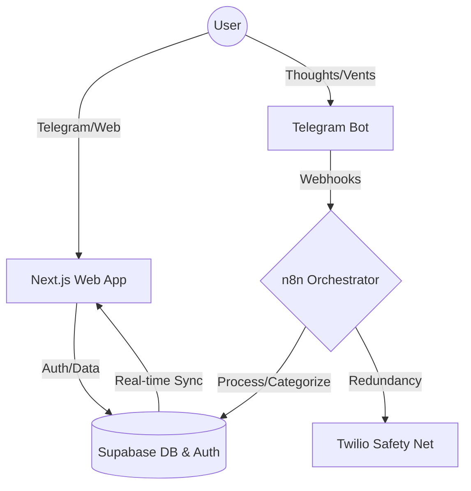

# 🧠 MindOps Web

MindOps is a **Mental Engineering** platform designed to act as an external cognitive processor. It translates unstructured mental noise into deterministic, structured action plans, effectively managing a user's "Cognitive RAM" to maintain peak execution momentum.

## ⚠️ The Problem: Cognitive Overload

In high-stress environments, a racing mind acts like a CPU at 100% utilization. Anxiety, rumination, and unstructured thoughts consume working memory, paralyzing decision-making and preventing execution. Traditional task managers fail in these scenarios because they require a calm mind to organize tasks; they don't help a user transition _from_ chaos _to_ order.

## 💡 The MindOps Solution

MindOps acts as a circuit breaker for cognitive loops. Users "vent" the raw, unstructured mess of their current thoughts into the MindOps Telegram Bot. The platform's cognitive engine processes this emotional and logistical noise, identifies patterns using historical data, and outputs a calm, prioritized, and rational plan of action directly to a web dashboard.

---

## 🏗️ System Architecture

MindOps follows a modular, event-driven architecture that rigorously separates concerns among user interaction, asynchronous cognitive processing, and visual analysis.



### 🧠 Core Mechanics & AI Patterns

The core automation resides in specialized n8n workflows (`n8n/workflows/`), acting as an asynchronous cognitive engine. The system implements advanced AI/ML integration patterns to ensure output determinism and user safety:

- **Semantic RAG (Retrieval-Augmented Generation):** Implements a semantic retrieval architecture on **Supabase** using the `pgvector` extension. It performs k-NN (k-nearest neighbors) searches via an optimized RPC function, calculating cosine similarity in a 768-dimensional latent space. This retrieves relevant historical user context for prompt injection, enabling the AI to detect recurrent behavioral patterns and provide highly personalized insights.
- **Deterministic State Machine:** Supabase acts as the strict state machine managing operational states (`PENDING`, `ACTIVE`, `COMPLETED`), guaranteeing the AI agent behaves deterministically rather than hallucinating unpredictable workflows.
- **Human in the Loop (HITL):** The system prioritizes human oversight and agency. Users must review, reject, or modify the AI's proposed "Atomic Action" plans before they become active missions.
- **Closed-Loop Safety Net:** A redundancy automation layer via **Twilio** that actively monitors user execution. If the system detects a state of high cognitive friction and there is no subsequent activity (e.g., clearing a suggested action) for a predefined period, it automatically triggers a physical phone call to the user to break the paralysis loop.

#### 🔄 Orchestration Modules & IaC (Infrastructure as Code)

To maintain environment consistency, all core workflows are version-controlled as JSON files within `n8n/workflows/`. 

**Automated GitHub Sync:** I engineered a dedicated, self-referential n8n workflow designed exclusively to export these project-specific workflow definitions and automatically push commits to this GitHub repository. This ensures the repo always reflects the active production logic inside the n8n orchestrator.


- **MindOps Orchestrator**: The central nervous system coordinating data flow.
- **Identity Onboarding (SW-1)**: Manages user lifecycle and state initialization.
- **Cognitive Engine (SW-2)**: Processes raw input into actionable mental patterns using RAG memory.
- **Mission Control (SW-3)**: Handles task prioritization and "Atomic Actions."
- **Telegram Integrator (SW-5)**: Manages real-time bidirectional communication. Instead of using native n8n nodes, it executes direct **HTTP requests against the Telegram API**, allowing for advanced payload customization (like dynamic inline keyboards) and robust error handling.

## 🌍 Globalization & State Synchronization (i18n)

MindOps is natively bilingual (English and Spanish) and implements a highly robust synchronization pattern to ensure zero UI flickering and cross-platform consistency.

- **Centralized Middleware Pattern:** Instead of relying solely on client-side state, Next.js `middleware.ts` intercepts every request. It determines the correct locale using a strict priority hierarchy: URL arguments (`?lang=es`) > Database User Profile > Telegram Session > Browser Cookies (`NEXT_LOCALE`) > Accept-Language Header.
- **Server-Component Injection:** The middleware injects the resolved language into a custom HTTP header (`x-next-intl-locale`). This allows React Server Components to render the exact language immediately on the server, completely eliminating the "flash of wrong language" on initial load.
- **Orchestrator Inheritance:** This language preference is synced back to Supabase, which the **n8n Brain Workflow** reads dynamically. As a result, when the AI generates action plans or parses "vents", the output logic and Telegram responses are inherently culturally and linguistically aligned with the user.

## 🛠️ Engineering Quality & Agent Skills

To maintain enterprise-level code quality, the frontend architecture was audited and refactored using specific intelligent constraints (Agent Skills):

- **Performance Optimization (`vercel-react-best-practices`):** Strict adherence to Vercel's engineering guidelines. Heavy UI components, such as the `CognitiveSimulator` containing complex Framer Motion animations, are lazy-loaded via `next/dynamic`. This aggressively reduces the initial JavaScript bundle size, ensuring lightning-fast Time-to-Interactive (TTI) for the landing page.
- **Accessibility & UI Standards (`web-design-guidelines`):** The interface is fully audited for A11y compliance. Interactive elements, including the `LanguageSwitcher` and dynamic navigation components, utilize correct semantic HTML roles (`role="group"`) and ARIA labels (`aria-hidden`, `aria-pressed`) to guarantee the "Mental Engineering" experience is accessible to screen readers without introducing cognitive noise.

## 🛠️ Tech Stack & Infrastructure

- **Core Framework:** [Next.js 15+](https://nextjs.org/) (App Router, Turbopack)
- **Runtime:** [React 19](https://react.dev/)
- **Database & Memory:** [Supabase](https://supabase.com/) (PostgreSQL, Auth, SSR) + `pgvector` for Semantic RAG
- **AI Orchestration:** [n8n](https://n8n.io/) (Workflow Automation) + LLMs
- **Communications:** Telegram API (Input) + [Twilio](https://www.twilio.com/) (Voice Alerts Redundancy)
- **UI & Analytics Dashboard:** [Tailwind CSS v4](https://tailwindcss.com/), [Framer Motion](https://www.framer.com/motion/), & [Tremor](https://www.tremor.so/) for cognitive friction charts and data visualization.
- **Infrastructure:** [Google Cloud Run](https://cloud.google.com/run) & [Docker](https://www.docker.com/) for isolated, scalable container deployment.

## ⚙️ Development & Local Setup

### Why Google Cloud Run? & Future Scalability

Unlike standard edge deployments, MindOps utilizes GCP Cloud Run to ensure full control over the container runtime, predictable scaling for data-heavy background processing, and seamless, long-running integration with complex backend n8n automation logic.

**Evolution Path (Queues & Workers):** The architecture is deliberately separated into isolated services. This makes it trivial to upgrade the communication layer from synchronous HTTP webhooks to an asynchronous **Message Queue** (like Google Cloud Pub/Sub or BullMQ). By introducing dedicated **Worker instances** for heavy AI parsing and RAG retrieval, the system can scale horizontally and handle thousands of concurrent "vent" events without bottlenecking the main orchestration engine.

### Local Initialization

1.  **Dependencies**:

    ```bash
    npm install --legacy-peer-deps
    ```

    _Note: `--legacy-peer-deps` is required for React 19 compatibility with UI libraries._

2.  **Environment**:
    Configure `NEXT_PUBLIC_SUPABASE_URL` and `NEXT_PUBLIC_SUPABASE_ANON_KEY` in your `.env.local`.

3.  **Run**:
    ```bash
    npm run dev
    ```

---

## 👨‍💻 About

<div align="right">
  
  
  <h3>Alejandro (Ale)</h3>
  <p>Software Engineer passionate about Mental Engineering, AI orchestrations, and building systems that make people more resilient and focused.</p>
  <p>MindOps is my approach to solving the modern crisis of cognitive overload through deterministic, structured action plans.</p>
  
  <p>
    <a href="https://github.com/aleocampodev"><b>GitHub</b></a> &nbsp;&bull;&nbsp; 
    <a href="#"><b>LinkedIn</b></a> &nbsp;&bull;&nbsp; 
    <a href="#"><b>Twitter/X</b></a>
  </p>
</div>

<br clear="both"/>

---

_Designed for efficiency. Built for the mind. ⚡_
