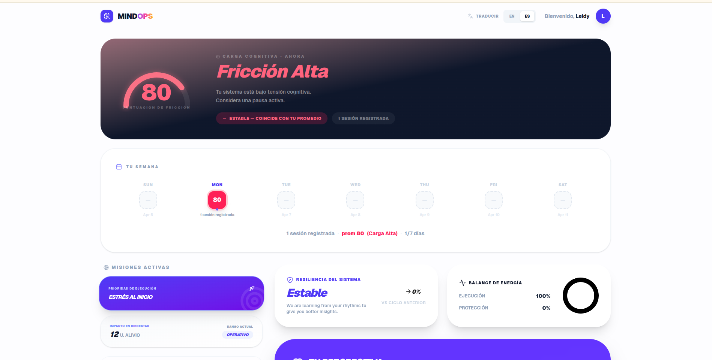
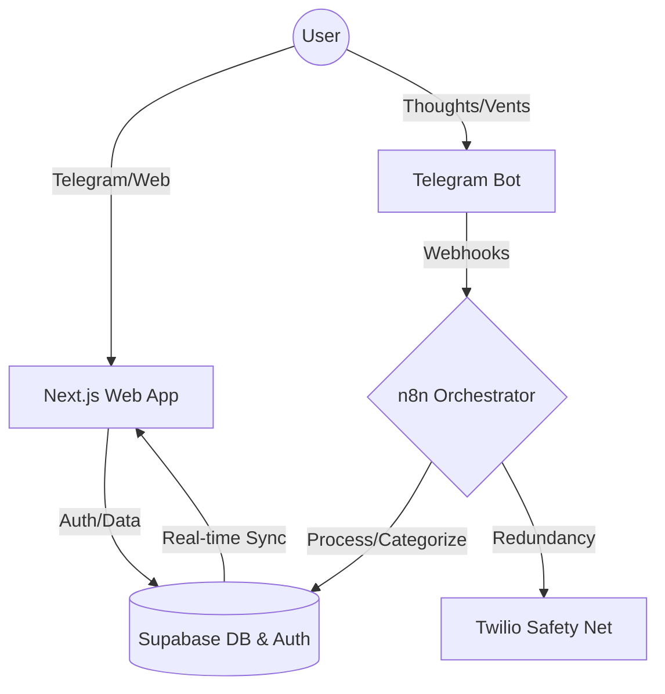
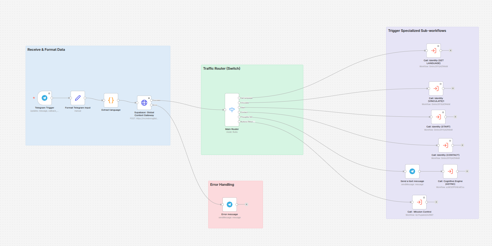

# 🧠 MindOps Web



MindOps is a **Mental Engineering** platform designed to act as an external cognitive processor. It translates unstructured mental noise into deterministic, structured action plans, effectively managing a user's "Cognitive RAM" to maintain peak execution momentum.

## ⚠️ The Problem: Cognitive Overload

In high-stress environments, a racing mind acts like a CPU at 100% utilization. Anxiety, rumination, and unstructured thoughts consume working memory, paralyzing decision-making and preventing execution. Traditional task managers fail in these scenarios because they require a calm mind to organize tasks; they don't help a user transition _from_ chaos _to_ order.

## 💡 The MindOps Solution

MindOps acts as a circuit breaker for cognitive loops. Users "vent" the raw, unstructured mess of their current thoughts into the MindOps Telegram Bot. The platform's cognitive engine processes this emotional and logistical noise, identifies patterns using historical data, and outputs a calm, prioritized, and rational plan of action directly to a web dashboard.

---

## 🏗️ System Architecture

MindOps follows a modular, event-driven architecture that rigorously separates concerns among user interaction, asynchronous cognitive processing, and visual analysis.



### 🧠 Core Mechanics & AI Patterns

The core automation resides in specialized n8n workflows (`n8n/workflows/`), acting as an asynchronous cognitive engine. The system implements advanced AI/ML integration patterns to ensure output determinism and user safety:

- **Semantic RAG (Retrieval-Augmented Generation):** Implements a semantic retrieval architecture on **Supabase** using the `pgvector` extension. It performs k-NN (k-nearest neighbors) searches via an optimized RPC function, calculating cosine similarity in a 768-dimensional latent space. This retrieves relevant historical user context for prompt injection, enabling the AI to detect recurrent behavioral patterns and provide highly personalized insights.
- **Deterministic State Machine:** Supabase acts as the strict state machine managing operational states (`PENDING`, `ACTIVE`, `COMPLETED`), guaranteeing the AI agent behaves deterministically rather than hallucinating unpredictable workflows.
- **Human in the Loop (HITL):** The system prioritizes human oversight and agency. Users must review, reject, or modify the AI's proposed "Atomic Action" plans before they become active missions.
- **Closed-Loop Safety Net:** A redundancy automation layer via **Twilio** that actively monitors user execution. If the system detects a state of high cognitive friction and there is no subsequent activity (e.g., clearing a suggested action) for a predefined period, it automatically triggers a physical phone call to the user to break the paralysis loop.

## 🤖 AI Agent Classification (n8n)

MindOps is engineered as a **Multi-Agent System** that aligns with the industry-standard agentic patterns defined by [n8n.io](https://n8n.io/ai-agents/):

- **Planning Agents:** The `Cognitive Engine (SW-2)` acts as a primary planner, decomposing abstract mental noise into structured, atomic "Mission Proposals."
- **Action Agents:** `Mission Control (SW-3)` and `Message Telegram (SW-5)` execute deterministic changes in cross-platform environments (Supabase, Telegram API).
- **Transactional RAG Agents:** Performs real-time retrieval of user state and **localized translations (Bilingual EN/ES support)** to ensure every interaction is context-aware and linguistically aligned.

**Consolidated GitHub Backup:** I engineered a high-performance, self-referential n8n workflow that exports all production logic into this repository. Unlike basic implementations, it utilizes the **GitHub Git Data API** to compare current workflow states against the repo and performs a **single, atomic consolidated commit** for all changes, maintaining a noise-free and professional git history.

### 🛡️ Resilience & Automated Monitoring

The infrastructure includes a specialized **Global Error Handler** (SW-ERR) using the `Error Trigger` architecture. This workflow actively monitors the entire orchestration layer and automatically generates real-time alerts via Email (SMTP) or Telegram, providing immediate visibility into execution failures with direct deep-links to the failing node.

#### 🔄 Orchestration Modules (n8n)

MindOps has been heavily optimized to eliminate N+1 latency issues via a pattern we call **Context Injection Gateway**.



- **Middleware (SW-0)**: Global context enricher. On every webhook, it executes a single, ultra-fast Supabase RPC (`get_bot_context`) to instantly hydrate the user's profile, linked language, LLM prompts, and all dynamic UI translations into memory.
- **Cognitive Engine (SW-1)**: The consolidated logic hub. Downstream agent logic reads directly from the SW-0 injected Memory payload (`$json.context`) to process user "vents", plan missions, and send telegram messages without making redundant database fetching calls.

*(For detailed architectural breakdown of this optimization, see our [Latency Optimization Post-Mortem](docs/LATENCY_OPTIMIZATION.md))*

## 🌍 Globalization & State Synchronization (i18n)

MindOps is natively bilingual (English and Spanish) and implements a highly robust synchronization pattern to ensure zero UI flickering and cross-platform consistency.

- **Centralized Middleware Pattern:** Instead of relying solely on client-side state, Next.js `middleware.ts` intercepts every request. It determines the correct locale using a strict priority hierarchy: URL arguments (`?lang=es`) > Database User Profile > Telegram Session > Browser Cookies (`NEXT_LOCALE`) > Accept-Language Header.
- **Server-Component Injection:** The middleware injects the resolved language into a custom HTTP header (`x-next-intl-locale`). This allows React Server Components to render the exact language immediately on the server, completely eliminating the "flash of wrong language" on initial load.
- **Orchestrator Inheritance:** This language preference is synced back to Supabase, which the **n8n Brain Workflow** reads dynamically. As a result, when the AI generates action plans or parses "vents", the output logic and Telegram responses are inherently culturally and linguistically aligned with the user.

## 🛠️ Engineering Quality & Agent Skills

To maintain enterprise-level code quality and ensure AI agents can reason about this codebase with consistent constraints, the architecture includes dedicated **Local Agent Skills** (`.agent/skills/mindops/`):

- **`supabase-patterns`**: Defines the strict `mindops` schema, data-fetching factories, and enum synchronization rules.
- **`i18n-guide`**: Protocols for the multi-layer locale cascade and translation key management.
- **`n8n-workflows`**: Visual documentation on hub-and-spoke architecture and node naming conventions.
- **`deploy-pipeline`**: IaC guidelines for GCP Cloud Run and CI/CD best practices.
- **`dashboard-widgets`**: Patterns for high-performance React charts using Tremor and Framer Motion.
- **`auth-middleware`**: Logic for the Telegram-to-Web pairing gate and route protection.

Additionally, the project adheres to:
- **Performance Optimization (`vercel-react-best-practices`):** Heavy UI components, such as `CognitiveSimulator`, are lazy-loaded via `next/dynamic` to ensure lightning-fast Time-to-Interactive (TTI).
- **Accessibility & UI Standards (`web-design-guidelines`):** Fully audited for A11y compliance using semantic roles and ARIA labels.

## 🛠️ Tech Stack & Infrastructure

- **Core Framework:** [Next.js 15+](https://nextjs.org/) (App Router, Turbopack)
- **Runtime:** [React 19](https://react.dev/)
- **Database & Memory:** [Supabase](https://supabase.com/) (PostgreSQL, Auth, SSR) + `pgvector` for Semantic RAG
- **AI Orchestration:** [n8n](https://n8n.io/) (Workflow Automation) + LLMs
- **Communications:** Telegram API (Input) + [Twilio](https://www.twilio.com/) (Voice Alerts Redundancy)
- **UI & Analytics Dashboard:** [Tailwind CSS v4](https://tailwindcss.com/), [Framer Motion](https://www.framer.com/motion/), & [Tremor](https://www.tremor.so/).
- **Infrastructure:** [Google Compute Engine (e2-micro)](https://cloud.google.com/compute) host. Leverages the GCP Free Tier with Swap memory, providing a dedicated, always-on runtime without cold starts.
    - `n8n/Dockerfile`: Isolated n8n runtime configuration.
    - `n8n/.env.example`: Standardized environment variable schema.

## ⚙️ Development & Local Setup

### 🌩️ Infrastructure Evolution: Why e2-micro over Cloud Run?

MindOps was migrated from Cloud Run to a dedicated **Google Compute Engine (e2-micro)** instance to maximize cost-efficiency (GCP Free Tier) and entirely eliminate cold starts.

To compensate for the `e2-micro`'s inherently limited RAM (1GB), the host OS is configured with a **Swap File**. This acts as a crucial safety buffer, preventing Out Of Memory (OOM) crashes during heavier LLM orchestrations or RAG vector executions, while relying entirely on **Supabase** outside the instance to offload all heavy database workloads.

#### Current Execution Model (Main Process vs. Workers)

To guarantee stability on a micro-instance, the n8n environment is deliberately configured for monolith execution rather than a distributed Queue/Worker model:

| Variable | Value | Architectural Purpose |
| :--- | :--- | :--- |
| `N8N_EXECUTIONS_PROCESS` | `main` | **Crucial:** Forces n8n to execute sub-workflows within the main Node thread. Extremely memory efficient for micro-instances. |
| `EXECUTIONS_DATA_SAVE_*` | `none`/`false` | Strict memory hygiene; prevents database bloat by not storing successful execution histories. |
| `DB_POSTGRESDB_*` | `[...]` | Bypasses local n8n SQLite in favor of the external managed Supabase connection, saving significant local RAM and CPU. |

**Why no Workers or Queue mode (yet)?**
Implementing n8n Queue mode requires additional infrastructure (a Redis broker and separate Worker nodes). For an `e2-micro` environment, adding Redis and multiprocess worker overhead would overwhelm the 1GB of RAM. By running `N8N_EXECUTIONS_PROCESS=main` and offloading the entire Database layer to **Supabase**, the architecture remains exceptionally lean, resilient, and perfectly sized for current traffic while keeping operational costs at near-zero.

**Evolution Path:** When traffic scales beyond the capacity of a monolithic e2-micro, the stateless architecture makes it trivial to upgrade to a Redis-backed Queue module and provision dedicated Worker instances on larger infrastructure.

### Local Initialization

1.  **Dependencies**:

    ```bash
    npm install --legacy-peer-deps
    ```

    _Note: `--legacy-peer-deps` is required for React 19 compatibility with UI libraries._

2.  **Environment**:
    Configure `NEXT_PUBLIC_SUPABASE_URL` and `NEXT_PUBLIC_SUPABASE_ANON_KEY` in your `.env.local`.

3.  **Run**:
    ```bash
    npm run dev
    ```

---

## 👨‍💻 About

<div align="right">
  
  
  <h3>Alejandro (Ale)</h3>
  <p>Software Engineer passionate about Mental Engineering, AI orchestrations, and building systems that make people more resilient and focused.</p>
  <p>MindOps is my approach to solving the modern crisis of cognitive overload through deterministic, structured action plans.</p>
  
  <p>
    <a href="https://github.com/aleocampodev"><b>GitHub</b></a> &nbsp;&bull;&nbsp; 
    <a href="#"><b>LinkedIn</b></a> &nbsp;&bull;&nbsp; 
    <a href="#"><b>Twitter/X</b></a>
  </p>
</div>

<br clear="both"/>

---

_Designed for efficiency. Built for the mind. ⚡_
