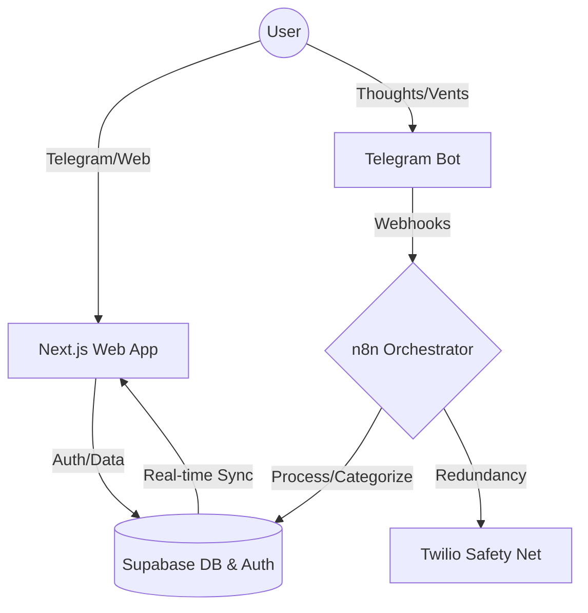

# 🧠 MindOps Web

[](https://github.com/aleocampodev/mindops-web/actions/workflows/ci.yml)
[](https://github.com/aleocampodev/mindops-web/actions/workflows/deploy.yml)

MindOps is a **Mental Engineering** platform designed to optimize biological and cognitive performance. It functions as a sophisticated monitoring system that translates mental patterns into actionable items, managing "Cognitive RAM" to maintain peak "Momentum."

## 🏗️ System Architecture

MindOps follows a modular, event-driven architecture that separates concerns between user interaction, asynchronous processing, and visual analysis.



### 🧠 Backend Orchestration (n8n)
The core logic resides in a series of specialized workflows located in `n8n/workflows/`, which act as an asynchronous cognitive engine:

*   **MindOps Orchestrator**: The central nervous system coordinating data flow.
*   **Identity Onboarding (SW-1)**: Manages user lifecycle and state initialization.
*   **Cognitive Engine (SW-2)**: Processes raw input into mental patterns.
*   **Mission Control (SW-3)**: Handles task prioritization and "Atomic Actions."
*   **Telegram Integrator (SW-5)**: Manages real-time bidirectional communication.
*   **Safety Net Protocol**: Redundancy layer via Twilio for critical alerts.

## 🛠️ Tech Stack

- **Core Framework:** [Next.js 15+](https://nextjs.org/) (App Router, Turbopack)
- **Runtime:** [React 19](https://react.dev/)
- **Infrastructure:** [Google Cloud Run](https://cloud.google.com/run) & [Docker](https://www.docker.com/)
- **Database & Auth:** [Supabase](https://supabase.com/) (SSR, Google OAuth)
- **UI Architecture:** [Tailwind CSS v4](https://tailwindcss.com/), [Framer Motion](https://www.framer.com/motion/), & [Tremor](https://www.tremor.so/)
- **CI/CD:** GitHub Actions for automated linting, builds, and GCP deployments.

## ⚙️ Development & Infrastructure

### Why Google Cloud Run?
Unlike standard edge deployments, MindOps utilizes GCP to ensure full control over the container environment, predictable scaling for data-heavy processing, and seamless integration with complex backend workflows.

### Local Setup
1.  **Dependencies**:
    ```bash
    npm install --legacy-peer-deps
    ```
    *Note: `--legacy-peer-deps` is required for React 19 compatibility with UI libraries.*

2.  **Environment**:
    Configure `NEXT_PUBLIC_SUPABASE_URL` and `NEXT_PUBLIC_SUPABASE_ANON_KEY`.

3.  **Run**:
    ```bash
    npm run dev
    ```

---
Designed for efficiency. Built for the mind. ⚡
