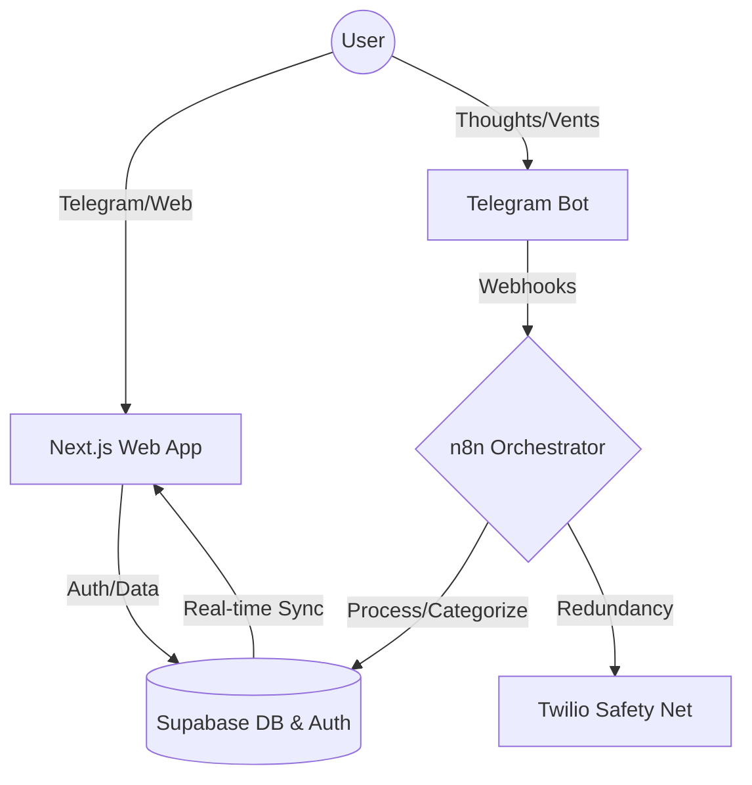

# 🧠 MindOps Web

[](https://github.com/aleocampodev/mindops-web/actions/workflows/ci.yml)
[](https://github.com/aleocampodev/mindops-web/actions/workflows/deploy.yml)

MindOps is a **Mental Engineering** platform designed to optimize biological and cognitive performance. It functions as a sophisticated monitoring system that translates mental patterns into actionable items, managing "Cognitive RAM" to maintain peak "Momentum."

## 🏗️ System Architecture

MindOps follows a modular, event-driven architecture that separates concerns between user interaction, asynchronous processing, and visual analysis.



### 🤖 Agent-Powered Development
This repository is **AI-Native**, utilizing custom agent skills located in `.agent/skills/` to ensure high-quality standards and automated maintenance:
*   **Performance & Inspection**: Automated tools for API performance and server action tracing.
*   **Code Quality**: Integrated refactor advisors and route analyzers to maintain architectural integrity.
*   **Productivity**: Designed for seamless collaboration between human developers and agentic AI.


### 🧠 Backend Orchestration & Cognitive Mechanics
The core automation resides in specialized n8n workflows (`n8n/workflows/`), acting as an asynchronous cognitive engine. The system implements advanced AI/ML patterns to ensure determinism and user safety:

*   **Semantic RAG (Retrieval-Augmented Generation):** Implements a semantic retrieval architecture on Supabase using the `pgvector` extension. It performs k-NN (k-nearest neighbors) searches via an optimized RPC function, calculating cosine similarity in a 768-dimensional latent space. This retrieves relevant historical user context for prompt injection, enabling the detection of recurrent behavioral patterns.
*   **Deterministic State Machine:** Supabase acts as the strict state machine managing operational states, guaranteeing the AI agent behaves deterministically.
*   **Human in the Loop (HITL):** The system requires human verification; users can review, reject, or modify the AI's proposed action plans.
*   **Closed-Loop Safety Net:** A redundancy layer via Twilio automatically triggers phone calls if the system detects the user is completely blocked and hasn't cleared suggested actions.

#### Workflow Modules
*   **MindOps Orchestrator**: The central nervous system coordinating data flow.
*   **Identity Onboarding (SW-1)**: Manages user lifecycle and state initialization.
*   **Cognitive Engine (SW-2)**: Processes raw input into actionable mental patterns using RAG memory.
*   **Mission Control (SW-3)**: Handles task prioritization and "Atomic Actions."
*   **Telegram Integrator (SW-5)**: Manages real-time bidirectional communication.
*   **Safety Net Protocol**: Twilio-based active intervention.

## 🛠️ Tech Stack & Infrastructure

- **Core Framework:** [Next.js 15+](https://nextjs.org/) (App Router, Turbopack)
- **Runtime:** [React 19](https://react.dev/)
- **Database & Memory:** [Supabase](https://supabase.com/) (SSR, Google OAuth) + `pgvector` for Semantic RAG
- **UI & Analytics Dashboard:** [Tailwind CSS v4](https://tailwindcss.com/), [Framer Motion](https://www.framer.com/motion/), & [Tremor](https://www.tremor.so/) for cognitive friction charts and analytics.
- **Infrastructure:** [Google Cloud Run](https://cloud.google.com/run) & [Docker](https://www.docker.com/) for isolated, scalable container deployment.
- **CI/CD:** GitHub Actions for automated linting, builds, and GCP deployments.

> [!IMPORTANT]
> **CI/CD Status**: GitHub Actions are currently paused due to an administrative billing lock on the account. Workflows will resume as soon as account status is restored.


## ⚙️ Development & Infrastructure

### Why Google Cloud Run?
Unlike standard edge deployments, MindOps utilizes GCP to ensure full control over the container environment, predictable scaling for data-heavy processing, and seamless integration with complex backend workflows.

### Local Setup
1.  **Dependencies**:
    ```bash
    npm install --legacy-peer-deps
    ```
    *Note: `--legacy-peer-deps` is required for React 19 compatibility with UI libraries.*

2.  **Environment**:
    Configure `NEXT_PUBLIC_SUPABASE_URL` and `NEXT_PUBLIC_SUPABASE_ANON_KEY`.

3.  **Run**:
    ```bash
    npm run dev
    ```

---
Designed for efficiency. Built for the mind. ⚡
