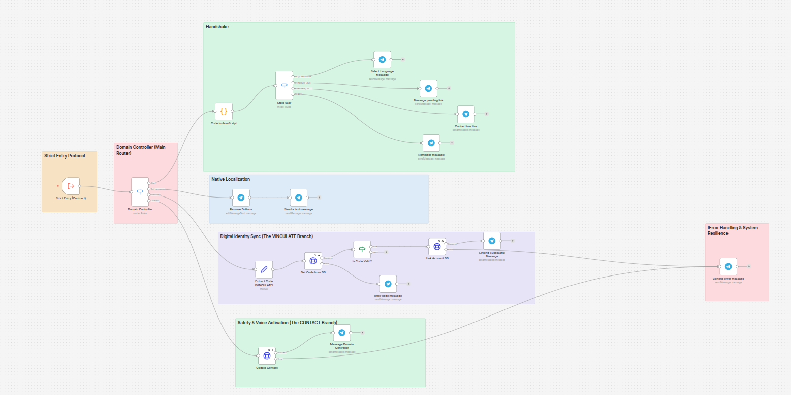
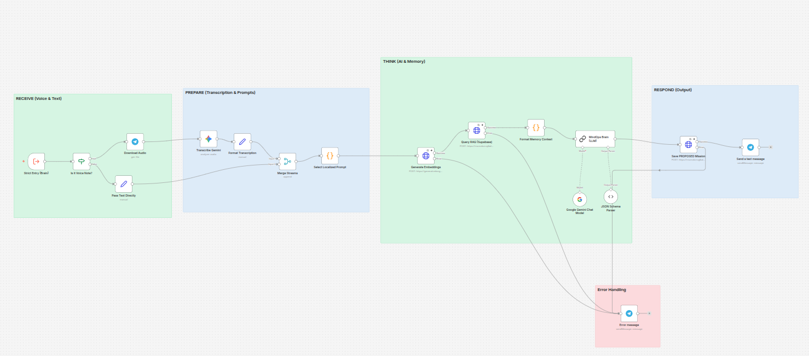
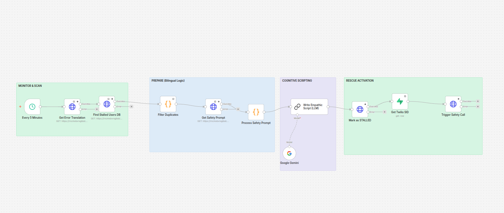
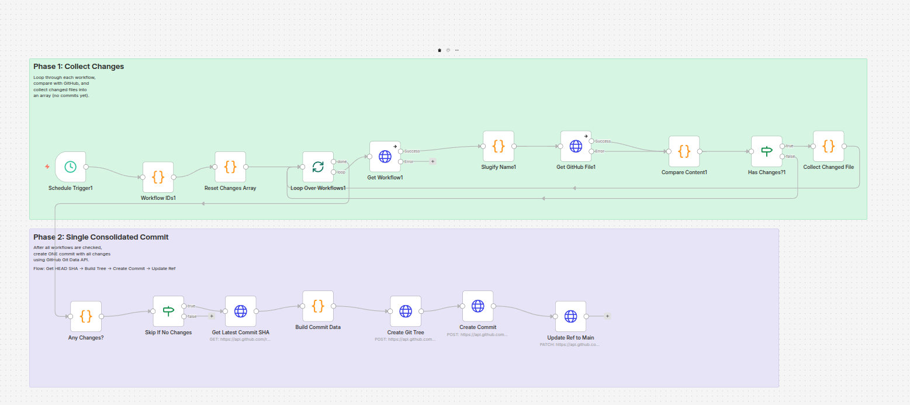

# 🧠 MindOps AI Orchestration Deep Dive

This document outlines the deterministic agentic workflows and hub-and-spoke orchestration patterns powering the MindOps platform. Each module is strictly segregated by domain to ensure scalability, robust error handling, and zero hallucination vulnerability.

---

## 🧭 MindOps Orchestrator (Main Hub)

**Description:**
The central nervous system of the architecture. It receives incoming webhooks, immediately executes the Global Context Gateway (SW-0) to instantly hydrate the deterministic state from Supabase, and uses a strict switch mechanism (`Traffic Router`) to delegate the payload to the specialized sub-workflows.

---

## 🚦 SW-1: Identity & State Machine Router

**Description:**
A strict deterministic state machine that manages the user onboarding lifecycle (`NO_LANGUAGE` ➡️ `PENDING_LINK` ➡️ `PENDING_CONTACT` ➡️ `READY`). It handles native localization, validates the Telegram-to-Web pairing code, and acts as a secure gateway, preventing unauthorized access to the cognitive engine.

---

## 🤖 SW-2: Cognitive Engine (LLM & Semantic RAG)

**Description:**
The core AI reasoning module. It processes unstructured user "vents" (Voice or Text) alongside historical memory retrieved via Supabase `pgvector` (RAG). It detects recurring emotional patterns and distills them into structured, actionable Atomic Missions, converting cognitive overload into clear momentum.

---

## 🎯 SW-3: Mission Control (Action Router)

**Description:**
The deterministic action dispatcher. It processes user callbacks (Plan Accepted / Plan Rejected) to execute transactional state changes in the Supabase database. It ensures that approved missions go `ACTIVE` instantly and manages the feedback loop without hallucinating interactions.

---

## 🚨 Twilio: Safety Net Protocol

**Description:**
An asynchronous cron-driven watchdog. Every 5 minutes, it scans the Supabase database for "Stalled" users (severe cognitive paralysis). If detected, it uses the LLM to generate an empathic rescue script and triggers an automated, localized Twilio voice call to guide the user back to emotional baseline.

---

## 💾 Backup Workflows to GitHub

**Description:**
A self-contained CI/CD pipeline built directly within n8n. It runs on a schedule to fetch all active workflows, loops through them to identify changes against the `main` branch of this GitHub repository, and creates a single consolidated commit using the GitHub Git Data API. This ensures full version control and infrastructure-as-code (IaC) compliance across all agents without manual exports.

---

## 🛠️ [System] Global Error Handler

**Description:**
A proactive, system-wide safety net. It listens for execution failures across all workflows using the Error Trigger. Upon intercepting an error, it formats the critical debug data into a structured payload and immediately dispatches an alert to the developer's Gmail. This guarantees real-time awareness of system bottlenecks or API failures, allowing for rapid, silent remediation before the end-user ever experiences friction.

![[System] Global Error Handler](../public/assets/global-error-handler.png)

---

## 🌩️ Infrastructure & Execution Constraints (e2-micro)

MindOps n8n workflows are intentionally designed to execute synchronously within a monolithic environment, specifically tailored for a **Google Compute Engine (e2-micro)** host. 

**Architectural Directives for micro-instances:**
1. **Monolithic Execution (`N8N_EXECUTIONS_PROCESS=main`)**: To operate safely within the 1GB RAM constraint of the `e2-micro`, the system does NOT use a distributed Queue/Worker model (which would require Redis and multiple processes). All AI orchestrations are processed entirely within the main Node.js thread, making the architecture exceptionally memory-efficient.
2. **Swap-Enabled Resilience**: The host utilizes a dedicated Swap file to buffer memory spikes during intensive RAG retrieval or heavy LLM parsing, preventing Out-Of-Memory (OOM) crashes.
3. **Database Offloading**: Local n8n SQLite usage is bypassed. All state management and semantic vector searches are fully offloaded to **Supabase** via PostgreSQL connection pooling. 

These constraints ensure the orchestration engine remains robust, highly stable and costs exactly zero to operate on the cloud, with a clear upgrade path to a multi-node Worker architecture if traffic scales.
